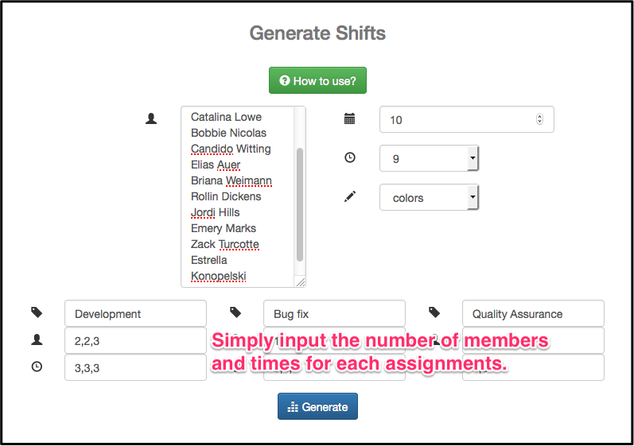
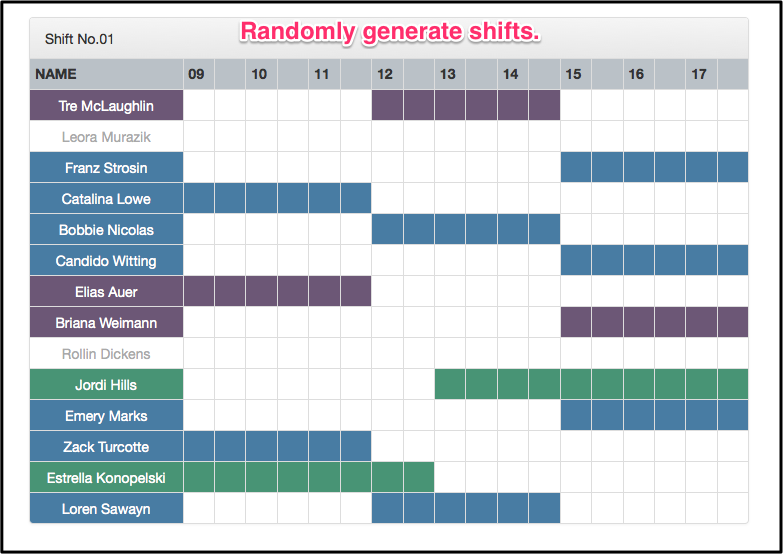
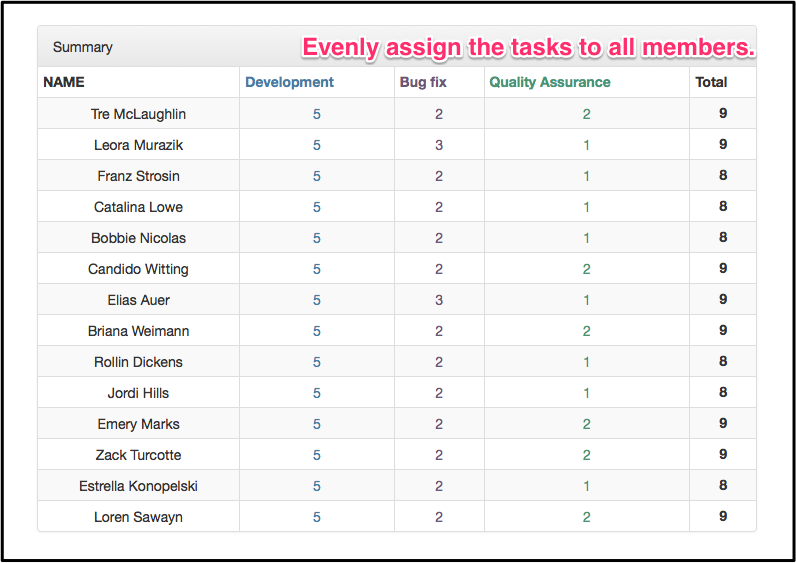

# ShiftGenerator

[](https://travis-ci.org/hkajiwara/ShiftGenerator)
[](https://coveralls.io/r/hkajiwara/ShiftGenerator)

_Simply, Randomly and Evenly generate shifts_





## Test & exec

1.Test
```
$ bundle exec rspec spec
```

2.Exec
```
$ bundle exec rackup config.ru
```

## Demo

https://shiftgen.herokuapp.com/

## License

Released under the [MIT Licenses](http://opensource.org/licenses/MIT)
